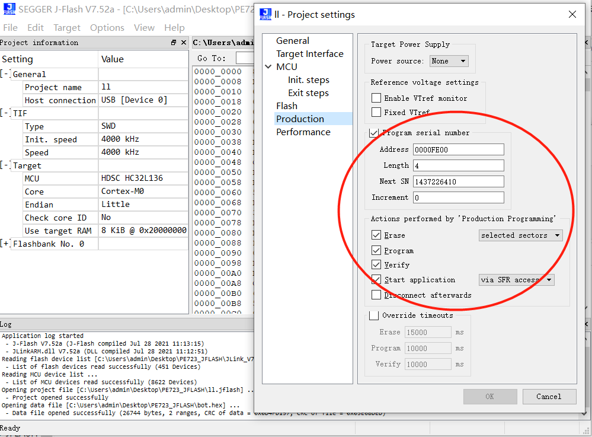
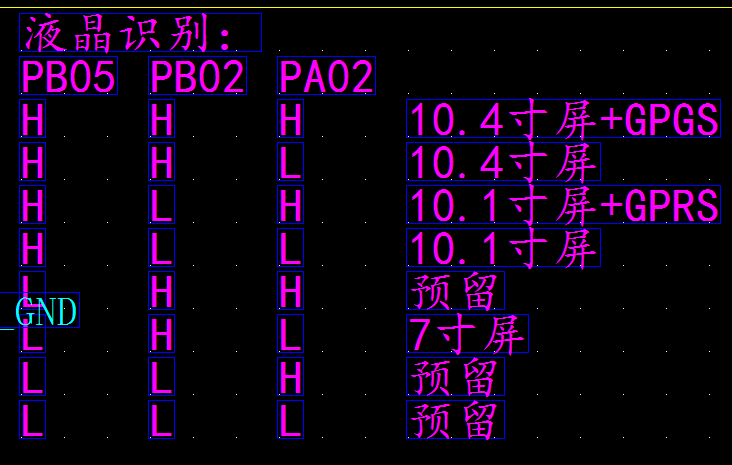

**项目使用keil_5 IDE打开后文本编码格式改为GB2312**  
**22.6.10添加了动态修改波特率**  
**22.6.12支持串口升级**  
**22.6-15 修改了Flash写机制 规避芯片大量写数据错误缺陷**  
**22.6-28 修改了与主控的交互的超时时间**  
**22.6-29 修改了升级标志写入FLASH地址**  
**22.7-1 修改了软件重启方式（饿死看门狗）NVIC_SysRest()函数重启无法关闭看门狗**  

**22.7-1 升级成功标志写入地址操作如下**  
**22.7-1 修改升级标志小端写入**  
```JSON
为了能让boot判断app内存区有无程序写入，程序烧录时就要写入升级成功标志
由于写入地址（0x0000FE00）不在程序内存范围则需要使用J-FLASH工具在程序合并打包成.jflash时
添加升级完成标志（0x55AA55AA）默认十进制小端写入即填入（0xAA55AA55)十进制数（1437226410)
如下图
```
  

**22.7.7增加了屏幕和GPRS模块的识别加入版本信息,识别规则如下图**    
　　
